# Database Schema

Entity-relationship diagram of the Budgeteer database. Source lives in [`database.mmd`](database.mmd); regenerate the rendered images with:

```sh
bunx @mermaid-js/mermaid-cli -i docs/database.mmd -o docs/database.svg
bunx @mermaid-js/mermaid-cli -i docs/database.mmd -o docs/database.png -w 2400 -H 1800 -b transparent
```



## Domain groupings

- **Identity & ownership** — `User` owns `Budget`s through `BudgetMembership` (which carries `role`). The user also pins a `default_budget` and `last_viewed_budget`.
- **Budget contents** — A `Budget` contains `Category` (self-FK, 2 levels), `PaymentMethod`, and per-month `CategoryBudget` rows that hold assigned amounts.
- **Transactions** — `Transaction` belongs to a budget and is split into one or more `TransactionLine` rows by category. It optionally references a `RecurringTransaction` template; instances are auto-generated from the template into concrete `Transaction`s.
- **Banking integration** — `SimpleFINConnection` → many `BankAccount` → many `BankTransaction`. A `BankAccount` optionally maps to a `PaymentMethod` (the bridge into a budget). A `BankTransaction` optionally links to a `Transaction` once confirmed.
- **Currency** — `Currency` is a code table joined by string code from `Transaction.currency`, `BankAccount.currency`, and `User.currency`.
