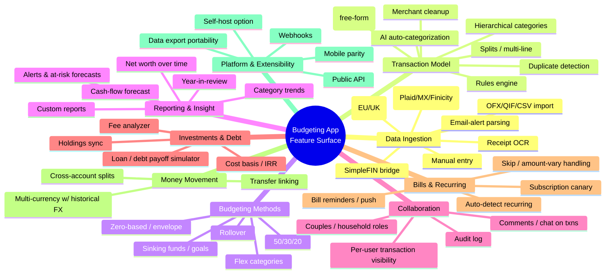
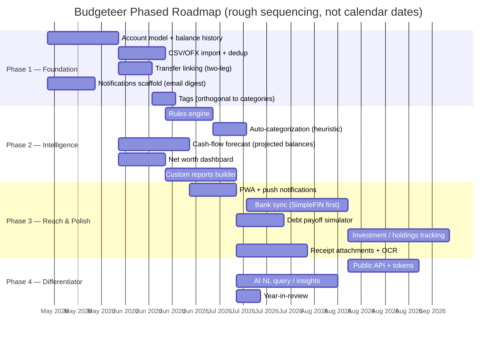

# Budgeteer Feature Roadmap

> **Generated:** 2026-05-05
> **Stack:** Django 6 + Inertia.js + React + Tailwind v4, Postgres, Celery worker, cron sidecar
> **Scope:** Competitive landscape research + prioritized roadmap based on what's already shipped vs. what users in 2025-2026 actually demand.

---

## 1. Landscape: What the Major Tools Are Known For

| Tool                           | Paradigm                                     | Killer Feature(s)                                                                                                                | Pricing (2026)                  | Notable Weakness                                                      |
|--------------------------------|----------------------------------------------|----------------------------------------------------------------------------------------------------------------------------------|---------------------------------|-----------------------------------------------------------------------|
| **YNAB**                       | Zero-based ("give every dollar a job")       | Category rollover, age-of-money, loan simulator, "YNAB Together" 6-user sharing, 34-day trial                                    | $14.99/mo, $109/yr              | Steep learning curve, manual upkeep, expensive                        |
| **Monarch Money**              | Account-aggregation + flexible budgeting     | Multi-aggregator (Plaid + MX + Finicity), couples mode w/ separate logins, net worth, investment tracking, household roles       | $14.99/mo, $99.99/yr            | 7-day trial, investment tracking shallow, Plaid breakage on small CUs |
| **Copilot Money**              | AI-driven categorization + forecast          | Per-user private ML categorization model, natural-language search, smart goals, "at-risk" budget forecasts, best-in-class iOS UX | $13/mo, $95/yr                  | iOS/Mac only — no Android, no web                                     |
| **Rocket Money**               | Bill negotiation + subscription cancellation | Subscription detection, bill negotiation service, simple budgets                                                                 | Freemium; premium $6-12/mo      | Light on actual budgeting depth                                       |
| **Empower (Personal Capital)** | Net-worth + investment dashboard             | Investment Checkup, fee analyzer, retirement planner, free tier                                                                  | Free (advisory upsell)          | Weak transactional budgeting                                          |
| **Quicken Simplifi**           | Cash-flow forecast                           | Projected balances up to 12 months out, multi-condition Advanced Rules                                                           | $3.99-5.99/mo                   | UI dated vs. Copilot/Monarch                                          |
| **Quicken Classic**            | Desktop power-user                           | Investment lots, tax categories, deep reports                                                                                    | $5-10/mo                        | Desktop-bound                                                         |
| **EveryDollar**                | Dave Ramsey zero-based                       | Baby Steps integration, simple zero-based UI                                                                                     | Free; Premium $17.99/mo         | Shallow reporting, US-only                                            |
| **PocketGuard**                | "In My Pocket" cash-flow                     | Debt payoff plan, after-bills spendable number                                                                                   | Free; Plus $12.99/mo            | Limited customization                                                 |
| **Goodbudget**                 | Envelope (manual)                            | True envelope discipline, no bank sync required, household sync                                                                  | Free; Plus $10/mo               | Manual entry friction                                                 |
| **Honeydue**                   | Couples-first                                | Per-account visibility toggles, bill reminders, chat on transactions                                                             | Free                            | Limited features overall                                              |
| **Lunch Money**                | Indie / power-user / multi-currency          | Multi-currency native, crypto, tags + categories, public API, Plaid-optional                                                     | $10/mo, $100/yr                 | No mobile-native app, no joint-budget mode                            |
| **Actual Budget**              | Open-source YNAB clone (envelope)            | Self-hostable, end-to-end encrypted sync, SimpleFIN/GoCardless, custom report engine, OFX/QIF import                             | Free / self-host or $4/mo cloud | Smaller community, fewer integrations                                 |
| **Tiller**                     | Spreadsheet-native                           | Auto-feeds into Google Sheets/Excel, AutoCat rules, full template ecosystem                                                      | $79/yr                          | Spreadsheet-only                                                      |
| **Firefly III**                | Open-source self-host                        | Highly configurable, double-entry, rules engine, webhooks, public API                                                            | Free (self-host)                | UX is technical                                                       |
| **MoneyMoney**                 | Mac-native, Euro-first                       | FinTS/HBCI direct bank, AppleScript automation                                                                                   | €30 one-time                    | Mac-only, EU-focused                                                  |

---

## 2. Cross-Cutting Feature Taxonomy

---

## 3. Ranked Cross-Cutting Features (Most-Demanded in 2025-2026)

Ranking signals: frequency of mention in NerdWallet/CNBC/Engadget reviews, repeat themes on r/ynab, r/MonarchMoney, r/personalfinance, and what every "missing from X" comparison article calls out. Tier reflects how often a missing version of this feature is a deal-breaker.

| # | Feature | Tier | Why users care |
|---|---------|------|----------------|
| 1 | **Bank/account sync** (with reliable reconnect UX) | Must-have | The #1 complaint across every app: "Plaid keeps breaking." Even apps that have it fail on small CUs. Manual-only is an explicit niche. |
| 2 | **Smart auto-categorization** (rules + ML) | Must-have | Copilot's per-user model is the gold standard. Users tolerate sync flakiness more than miscategorization. |
| 3 | **Net worth tracking** (accounts + assets + liabilities over time) | Must-have | Every "Mint replacement" thread leads with this. |
| 4 | **Couples / household sharing** with separate logins & roles | Must-have | The single biggest reason users leave YNAB for Monarch. |
| 5 | **Cash-flow forecast** (projected balances 1-12mo out from recurring) | High | Simplifi's signature feature; Copilot adopted it. Differentiator-turned-table-stakes. |
| 6 | **Recurring/subscription detection** & bill reminders | High | Rocket Money's wedge; users want surprise-free months. |
| 7 | **Custom reports & dashboards** (date ranges, category drill-down, export) | High | Actual's custom report engine is a frequent power-user reason to leave Monarch. |
| 8 | **Goals / sinking funds** with target dates and auto-funding math | High | Core to YNAB's value prop; sinking funds frequently asked-for in Monarch. |
| 9 | **Investment / holdings tracking** with cost basis | High | Empower's wedge, persistent gap in YNAB. |
| 10 | **Mobile apps with feature parity** (or great mobile-web PWA) | High | Copilot's iOS-only reach is a constant complaint. |
| 11 | **Transfer detection** (link both legs of an inter-account transfer) | High | Without this, reports double-count. |
| 12 | **Debt payoff simulator** (avalanche/snowball, what-ifs) | Mid | YNAB's loan planner, PocketGuard's debt plan. |
| 13 | **Multi-currency** w/ historical FX | Mid | Lunch Money's wedge. Globally distributed users. |
| 14 | **Receipt OCR / capture** | Mid | Mainstream-y but rarely a switching reason for personal users. Bigger in business expense apps. |
| 15 | **Public API / webhooks / data export** | Mid (power-users) | Lunch Money/Firefly's wedge. Drives extensibility. |
| 16 | **CSV/OFX/QIF import** as a fallback when sync fails | Mid | Actual emphasizes this; fills the gap when Plaid breaks. |
| 17 | **Tags** (orthogonal to categories) | Mid | Lunch Money/Firefly. Useful for projects, vacations. |
| 18 | **Year-in-review / spending insights** | Mid | Engagement feature. Copilot does it well. |
| 19 | **AI chat / natural-language query** | Emerging | Copilot is leading; differentiator, not table-stakes yet. |
| 20 | **Bill negotiation / subscription cancellation** | Niche | Rocket Money's wedge; out of scope for most. |

---

## 4. Gap Analysis vs. Budgeteer Today

Confirmed by reading `/Users/zane/Sites/Budgeteer/apps/budget/models.py` and `/Users/zane/Sites/Budgeteer/apps/budget/data.py`.

| Rank | Feature | Status | Evidence in Budgeteer |
|------|---------|--------|-----------------------|
| 1 | Bank sync | Missing | No `Account` model with sync metadata, no Plaid/SimpleFIN integration |
| 2 | Auto-categorization (rules/ML) | Missing | No `Rule` model; categorization is manual via `TransactionLine` |
| 3 | Net worth tracking | Missing | No account-balance history, no assets/liabilities model |
| 4 | Couples / household sharing | Have | `BudgetMembership` w/ owner/member roles |
| 5 | Cash-flow forecast | Partial | `get_upcoming_transactions` shows next 7 days; no projected balance curve |
| 6 | Recurring + bill reminders | Partial | `RecurringTransaction` + `generate_recurring_instances` cron exists; no notifications/email/push |
| 7 | Custom reports | Missing | `data.py` has a single `get_budget_overview`; no report builder |
| 8 | Goals / sinking funds | Have | `Category.is_sinking_fund` + target/due/ongoing fields, all-time `total_saved` math |
| 9 | Investment tracking | Missing | No `Holding`/`Security` model |
| 10 | Mobile parity | Partial | Inertia/React SPA is responsive but no native app, no PWA manifest confirmed |
| 11 | Transfer detection | Partial | `transaction_type="transfer"` exists; no two-leg link or auto-detection |
| 12 | Debt payoff simulator | Missing | No loan model |
| 13 | Multi-currency + historical FX | Have | `currency`, `exchange_rate_to_usd` on `Transaction`, `amount_usd` on `TransactionLine`, `update_exchange_rates` cron |
| 14 | Receipt OCR | Missing | No attachments on `Transaction`; MinIO is wired generally but unused here |
| 15 | Public API / webhooks | Missing | All endpoints are Inertia/JsonResponse for the SPA; no DRF or token auth |
| 16 | CSV/OFX/QIF import | Missing | No import management command |
| 17 | Tags | Missing | Only `Category` (hierarchical/flat unclear, but no `Tag` model) |
| 18 | Year-in-review | Missing | No annual rollup view |
| 19 | AI chat / NL query | Missing | — |
| 20 | Bill negotiation | Out of scope | — |

**Summary:** Budgeteer's strong areas are exactly the ones zero-based / envelope tools own (sinking funds, recurring, multi-currency, household sharing). Its gaps are all on the **aggregation, automation, and forecast** axis where Monarch/Copilot/Simplifi compete.

---

## 5. Prioritized Roadmap

### Phase 1 — Foundation (the prerequisites everything else needs)

#### 1.1 First-class `Account` model with balance history — **L**
- **Why:** Every higher-tier feature (net worth, forecast, sync, transfers) needs a real Account abstraction. `PaymentMethod` today is a tag for credit/debit/cash, not an account with a balance.
- **What:** New `Account` model (name, type, currency, opening balance, institution, optional external sync ID) plus `AccountBalanceSnapshot` (account, date, balance) updated by transaction posting + nightly cron. Migrate existing `PaymentMethod` to a thinner "card descriptor" or fold it in.
- **Stack notes:** New Django models + migrations; serializer in `apps/budget/data.py`; new `Accounts.tsx` page; balance recalculation runs as a `update_account_balances` management command in the cron sidecar.

#### 1.2 CSV / OFX / QIF importer — **M**
- **Why:** The single most reliable bank-sync substitute. Actual Budget treats this as a first-class flow because Plaid breaks. Buys time before real bank sync.
- **What:** Upload page → preview/dedup screen → commit. Match merchants to existing transactions by date+amount+description with a configurable window.
- **Stack notes:** `ofxparse` and standard CSV libs; staging table for pre-commit review; Inertia page with a step-wizard; new `import_transactions` management command for CLI.

#### 1.3 Transfer linking — **S**
- **Why:** Without it, "I moved $500 from checking to savings" double-counts in reports and inflates spending.
- **What:** When `transaction_type="transfer"` is set, allow linking to a counterpart `Transaction` on another account. Heuristic auto-match: same amount, opposite sign, within 3 days, different accounts.
- **Stack notes:** `Transaction.transfer_partner = ForeignKey("self", null=True)` plus a reconciliation pass in the import flow.

#### 1.4 Notifications scaffold — **M**
- **Why:** Bill reminders, recurring alerts, and at-risk forecasts all need this rail. No existing infra confirmed.
- **What:** `Notification` model + per-user channel preferences (email + in-app) + a daily `send_digests` management command. Hook into existing `generate_recurring_instances`.
- **Stack notes:** Reuses cron sidecar; Django email + an Inertia bell badge in `AppLayout`. Push (web/PWA) deferred to Phase 3.

#### 1.5 Tags — **S**
- **Why:** Categories are budget buckets; tags are orthogonal slices ("vacation 2026", "kid #1"). Lunch Money users specifically cite this. Cheap to add.
- **What:** `Tag` model on the budget; M2M from `TransactionLine` (or `Transaction`).
- **Stack notes:** Pure model + serializer change; UI is a chip input on the transaction modal.

### Phase 2 — Intelligence (the things that make Budgeteer feel modern)

#### 2.1 Rules engine — **M**
- **Why:** Tiller's AutoCat and Monarch's rules are core daily-use features. Required before any auto-categorization can be transparent and trusted.
- **What:** `TransactionRule` model with conditions (description regex, amount range, account, payment method) and actions (set category, add tag, set notes). Apply on import, optionally backfill.
- **Stack notes:** Pure Django; rule evaluation in `apps/budget/services/rules.py`. Rules page in React with conditional builder UI.

#### 2.2 Heuristic auto-categorization — **M**
- **Why:** Closes the loop: import CSV → rules apply → user only fixes the leftovers. Avoids the cost/complexity of an ML model on day one.
- **What:** On unmatched transactions, suggest a category by majority vote of past transactions with similar description (token overlap or fuzzy match). User confirms; the confirmation can optionally write a rule.
- **Stack notes:** Postgres trigram (`pg_trgm`) for similarity; no ML dependency. Defer per-user ML model (Copilot-style) to a later AI-flavored phase.

#### 2.3 Cash-flow forecast — **L**
- **Why:** Quicken Simplifi made this a category-defining feature; Copilot followed. With recurring transactions and accounts already modeled, this is a high-leverage addition.
- **What:** Project each account's balance forward 1-12 months by walking active `RecurringTransaction`s and converting to user currency. Render as a line chart with a daily granularity, marked with low-balance warnings.
- **Stack notes:** Compute server-side on demand (cacheable); render with Recharts on the frontend. Reuse existing `RecurringTransaction.next_due_date_after`. Lives as a new `Forecast.tsx` Inertia page.

#### 2.4 Net worth dashboard — **M**
- **Why:** Top-3 demanded feature. Already 80% there once `Account` exists.
- **What:** Time-series line chart of total balances across all accounts (with debts as negatives). Per-account breakdown. Date range picker.
- **Stack notes:** Reads `AccountBalanceSnapshot` series; Recharts on the frontend. Add to dashboard or new page.

#### 2.5 Custom reports — **L**
- **Why:** Power-user differentiator. Actual Budget's report engine is one of its top retention drivers. Users who want this are also the ones who'd self-host Budgeteer.
- **What:** Predefined reports (cash flow, category trend, income vs expense, payee spending) with custom date range, category filter, currency. CSV export.
- **Stack notes:** Server-side aggregation in `apps/budget/data.py`; new Reports page; download endpoint returns CSV. Defer fully-custom report builder until predefined reports stabilize.

### Phase 3 — Reach & Polish (broader audience, table-stakes for "real" budgeting app)

#### 3.1 PWA + push notifications — **M**
- **Why:** Cheapest path to a "mobile app" experience without building React Native. Closes a real gap vs Monarch/Copilot.
- **What:** Web manifest, service worker for offline shell + Web Push.
- **Stack notes:** Vite plugin for PWA; VAPID-based Web Push; reuse `Notification` model.

#### 3.2 Bank sync via SimpleFIN — **L**
- **Why:** Real bank sync is the #1 demanded feature, but Plaid is expensive and gated by business verification. SimpleFIN Bridge ($1.50/mo per user) is **powered by MX under the hood**, so it inherits ~16,000+ US/Canadian institutions — Chase, BofA, Wells, Citi, Capital One, big credit unions, plus Fidelity/Schwab/Vanguard for investments. Same choice Actual Budget made.
- **Constraints to design around:** (1) once-daily refresh — no realtime/webhooks; (2) **90-day transaction backfill cap** — hard limit, can't be negotiated, so the Phase 1 CSV/OFX importer stays a first-class citizen permanently for historical backfill; (3) occasional stale connections requiring user re-link; (4) balance-vs-transaction desync edge cases.
- **What:** Token storage on `Account`; cron `sync_accounts` command (every 6h is fine — bridge refreshes ~daily) pulls transactions and runs them through the Phase 1 import pipeline (rules + dedup).
- **Stack notes:** SimpleFIN bridge HTTP API is trivial; wrap behind a `SyncProvider` interface so Plaid can be added later as a second implementation without touching domain models. GoCardless is the equivalent move for EU users.
- **Future fallback providers** (not implementing now, but the `SyncProvider` abstraction should accommodate):
  - **Teller** — developer-friendly aggregator, free dev tier, ~$0.10/account/mo in production. Realtime webhooks and longer history than SimpleFIN. Worth revisiting if SimpleFIN's 90-day backfill cap or daily-only refresh becomes a real pain.
  - **Plaid** — free dev tier with 100 live items (enough for personal use); production still requires business verification + entity. Right move only if Budgeteer's scope shifts from personal tool to public SaaS.
  - **MX direct, Finicity direct** — ruled out: enterprise-sales-only, 5-figure+ annual contracts. SimpleFIN already proxies MX, so this would only matter if going B2B.

#### 3.3 Debt payoff simulator — **M**
- **Why:** YNAB and PocketGuard own this. Needs a `Loan`/`Debt` model that doesn't exist today.
- **What:** Loan accounts (balance, APR, min payment); avalanche vs snowball strategy; what-if extra-payment slider; payoff date projection.
- **Stack notes:** Mostly client-side math once loans are modeled; nothing blocking on Django side.

#### 3.4 Investment / holdings tracking — **L**
- **Why:** A persistent gap in YNAB. Required for a credible "complete picture" pitch. Lower priority for Budgeteer's likely user base (zero-based budgeters).
- **What:** `Security`, `Holding`, `HoldingTransaction` models; daily price refresh (Alpha Vantage / Yahoo / Stooq); cost basis + simple IRR.
- **Stack notes:** Cron sidecar adds `update_security_prices`. Significant model + UI work; consider keeping it read-only at first (manual entry only, no broker sync).

#### 3.5 Receipt attachments + OCR — **M**
- **Why:** "Attach a receipt to a transaction" is a low-controversy quality-of-life feature. OCR is gravy.
- **What:** File field on `Transaction` (MinIO already wired), thumbnail/preview UI. Optional async OCR via Tesseract or a cloud API to pre-fill amount/date suggestions.
- **Stack notes:** Use existing storage backend; OCR runs as a Celery task on upload.

### Phase 4 — Differentiator

#### 4.1 Public API + token auth — **M**
- **Why:** Lunch Money's "the API is the product" positioning earns it a devoted niche. A self-hosted budgeting app without an API is a missed opportunity.
- **What:** DRF or `django-ninja` mounted at `/api/v1/`; per-user Personal Access Tokens; same `BudgetMembership` enforcement as Inertia views.
- **Stack notes:** `django-ninja` fits Pydantic-style serialization neatly; reuse the dict shapes from `data.py`.

#### 4.2 AI natural-language query / insights — **L**
- **Why:** Copilot is alone in shipping this well. Real differentiator if done right; gimmick if done poorly.
- **What:** "Show me grocery spending last 3 months vs same period last year" → translates to a structured query against the reports engine. Start narrow (predefined intents), expand.
- **Stack notes:** LLM call (Anthropic or OpenAI) that emits JSON for the existing reports engine, *not* free-form SQL. Gate behind a setting; never auto-execute mutations.

#### 4.3 Year-in-review — **S**
- **Why:** Engagement / retention; cheap once reports exist.
- **What:** Annual page: top categories, biggest swings YoY, sinking-fund wins, savings rate.
- **Stack notes:** Pure read on existing data; lives as `YearInReview.tsx`.

---

## 6. What I Deliberately Left Out (and Why)

- **Bill negotiation / subscription cancellation** (Rocket Money). Requires partnerships, customer service, and a different business model. Out of scope.
- **Native iOS/Android apps.** PWA covers ~90% of the value at ~10% of the effort given Inertia/React already in place. Revisit only if a specific OS feature (Apple Wallet, widgets, Siri) becomes important.
- **Per-user ML categorization** (Copilot-style private models). Heuristic + rules covers most of the value. Re-evaluate after Phase 2 ships and there's real usage data to learn from.
- **Crypto holdings.** Lunch Money tracks it; most users don't materially need it. Defer unless asked.
- **Direct broker connections** (Plaid Investments, etc.). High cost, low return for the target audience. Manual entry first, or read from CSV exports.

---

## 7. Source Notes

Cross-checked across:
- NerdWallet, Engadget, CNBC, Experian, College Investor 2026 budget-app roundups
- Monarch, YNAB, Copilot, Lunch Money, Actual Budget official docs and help centers
- Reddit r/ynab, r/MonarchMoney, r/personalfinance threads (via summaries)
- SimpleFIN protocol docs, Actual Budget docs

Specifically used:
- https://www.nerdwallet.com/finance/learn/best-budget-apps
- https://www.engadget.com/apps/best-budgeting-apps-120036303.html
- https://thecollegeinvestor.com/32672/best-budgeting-apps/
- https://thecollegeinvestor.com/41976/copilot-review/
- https://help.copilot.money/en/articles/8182433-copilot-intelligence-for-spending
- https://intelligence.copilot.money/
- https://actualbudget.org/docs/advanced/bank-sync/simplefin/
- https://www.simplefin.org/protocol.html
- https://beta-bridge.simplefin.org/search-institutions
- https://teller.io/ (alternative aggregator, indie-friendly pricing)
- https://www.vendr.com/buyer-guides/mx-technologies (MX pricing floor reference)
- https://robberger.com/monarch-money-review/
- https://www.aitooldiscovery.com/guides/monarch-money-reddit
- https://www.quicken.com/blog/best-personal-finance-software-for-cash-flow-and-expense-tracking/

> Pricing and exact feature claims for fast-moving products (Copilot AI surface, Monarch trial length, SimpleFIN pricing) were last verified May 2026; confirm before quoting in marketing copy.
